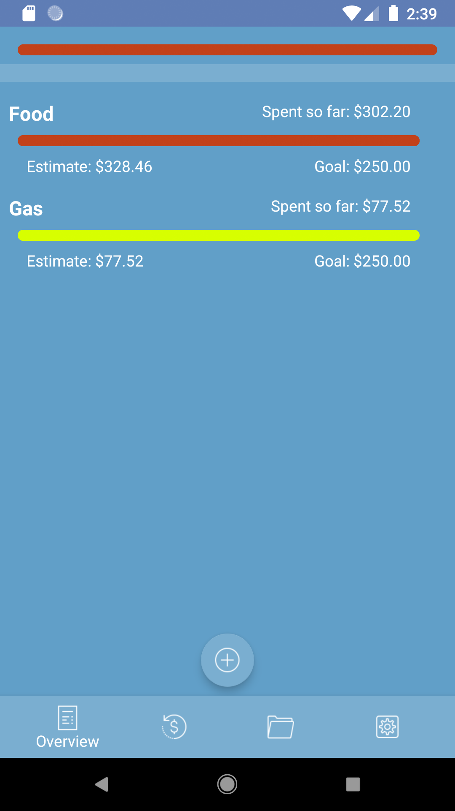

Savant Spender - A Personal Budgeting Application

Features:

- Link to your bank account(s) using the Plaid API
- Periodically downloads transactions
- User categorizes transactions using goal tags
- User can create goals, selecting those tags which apply
- If the user is on track to overspend their goals, the application provides a warning. A red goal is on track to be overspent. A yellow goal is reachable. A green goal means the user is underspending at their current rate

